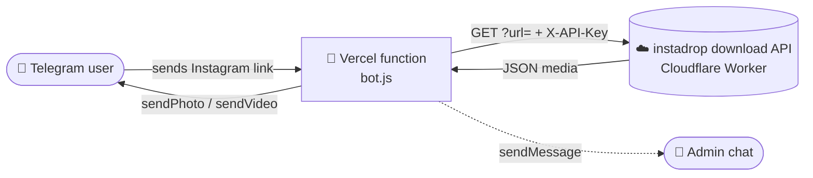

<!-- ===================== HEADER ===================== -->

<div align="center">


<br/>

<a href="https://t.me/Instadrop_tgbot?start=start">
  
</a>

<br/><br/>

<a href="https://t.me/Instadrop_tgbot?start=start">
  
</a>

<br/>

<a href="https://t.me/Instadrop_tgbot?start=start">
  
</a>


<br/><br/>

**<a href="https://t.me/Instadrop_tgbot?start=start">▶️ Start the bot on Telegram</a>** &nbsp;·&nbsp; [t.me/Instadrop_tgbot](https://t.me/Instadrop_tgbot?start=start)

</div>

---

<!-- ===================== ABOUT ===================== -->

##  About

A fast, **multilingual Instagram downloader bot** for Telegram, running as a single
serverless function on [Vercel](https://vercel.com).

Paste an Instagram link into the chat — the bot sends the media back. That's it.

> **No ads · No login · No limits.**

<div align="center">

|  Link to bot |  Website |  Host |
| :---: | :---: | :---: |
| [t.me/Instadrop_tgbot](https://t.me/Instadrop_tgbot?start=start) | [instadrop.web.app](https://instadrop.web.app/) | Vercel Serverless |

</div>

---

<!-- ===================== FEATURES ===================== -->

##  Features

<table>
<tr>
<td width="50%" valign="top">

** Supported content**

- 📸 Posts
- 🖼️ Carousels
- 🎬 Reels
- 📖 Stories
- ✨ Highlights
- 👤 Profiles

</td>
<td width="50%" valign="top">

** Media details**

- 👤 Username & caption
- 📅 Upload date
- ❤️ Likes & 💬 comments
- 👀 Views & ▶️ plays
- 🔁 Reshares
- 👥 Followers / following / posts

</td>
</tr>
<tr>
<td width="50%" valign="top">

** Smart behaviour**

- 🌍 Auto language detection (from Telegram)
- ❤️ Auto heart reaction on any link
- 🔔 Admin notification on each new user
- 🧩 Inline buttons for language / cover / details
- 🛟 Graceful fallbacks (video → document, photo → document → text)

</td>
<td width="50%" valign="top">

** Languages**

🇬🇧 English · 🇷🇺 Русский · 🇺🇿 O‘zbek · 🇮🇩 Bahasa Indonesia ·
🇸🇦 العربية · 🇺🇦 Українська · 🇮🇷 فارسی · 🇹🇷 Türkçe · 🇮🇳 हिन्दी

</td>
</tr>
</table>

---

<!-- ===================== HOW IT WORKS ===================== -->

##  How it works



1. Telegram delivers every update to the Vercel function via a webhook (`POST`).
2. The handler checks for a **callback query** (button press) or a **text message**.
3. If a message contains an Instagram URL, it is forwarded to the download API.
4. The API's JSON response is parsed, media is extracted, and the bot sends the
   photo/video back — with a **Cover Photo** / **Details** keyboard attached.

---

<!-- ===================== COMMANDS ===================== -->

##  Commands

| Command | Description |
| :--- | :--- |
| `/start` | Welcome message with feature overview + buttons |
| `/language` | Open the language selection menu |
| `/help` | Help text in the user's current language |
| *any Instagram link* | Triggers a download |

Non-link text gets a friendly "send me an Instagram link" prompt.

**Inline buttons**

| Button | Callback data |
| :--- | :--- |
| 🌍 Choose language | `open_language` |
| 🌐 Open instadrop | URL → website |
| 🖼️ Get Cover Photo | `get_cover:<id>` |
| 📋 Get Details | `get_details:<id>` |
| Language options | `lang:<code>` |

---

<!-- ===================== CONFIG ===================== -->

##  Configuration

All configuration is via **environment variables** (set these in your Vercel project):

| Variable | Required | Description |
| :--- | :---: | :--- |
| `TELEGRAM_BOT_TOKEN` | ✅ | Token from [@BotFather](https://t.me/BotFather) |
| `ADMIN_CHAT_ID` | ✅ | Chat ID that receives new-user notifications |
| `API_KEY` | ✅ | API key for the download service (`X-API-Key` header) |

Hardcoded constants at the top of `bot.js`:

| Constant | Value |
| :--- | :--- |
| `API_URL` | `https://instadrop.rishu-rishad2019.workers.dev/?url=` |
| `WELCOME_IMAGE` | `https://instadrop.web.app/og-image.png` |
| `WEBSITE_URL` | `https://instadrop.web.app/` |

---

<!-- ===================== DEPLOY ===================== -->

##  Deploy on Vercel

1. Push this code to a Git repository and import it into Vercel, **or** deploy the
   file as an API route, e.g. `api/bot.js` (the default export is the webhook handler).
2. Add the three environment variables above.
3. Deploy, then register the webhook with Telegram:

   ```bash
   curl "https://api.telegram.org/bot<TOKEN>/setWebhook?url=https://<your-project>.vercel.app/api/bot"
   ```

4. Verify:

   ```bash
   curl "https://api.telegram.org/bot<TOKEN>/getWebhookInfo"
   ```

   You can also open the deployed URL in a browser — a `GET` returns
   `{"ok":true,"message":"instadrop Telegram bot is running."}`.

> ℹ️ **Runtime:** requires **Node.js 18+** (uses global `fetch` and `AbortSignal.timeout`).

---

<!-- ===================== STRUCTURE ===================== -->

##  Project structure

The entire bot lives in a single file, **`bot.js`**, organised into sections:

| Section | Purpose |
| :--- | :--- |
| Configuration | Env vars and hardcoded constants |
| Temporary storage | In-memory maps/sets for media, notified users, language prefs |
| Supported languages | The `LANGUAGES` table |
| Translations | The `TEXT` table (all UI strings, per language) |
| Language helpers | `getLanguage`, `setLanguage`, `t`, `languageKeyboard` |
| Telegram API | `telegram(method, payload)` — wraps the Bot API |
| Basic helpers | URL validation/cleanup, ID generation, truncation |
| Link detection | Instagram URL + generic URL extraction |
| Media parsing | Response type / reel detection / media & cover extraction |
| Storage & keyboards | `storeMedia`, `buildMediaKeyboard` |
| Details formatting | `formatDetails` — builds localized metadata text |
| Sending | `sendMedia`, `sendCollectionHeader`, `notifyAdmin`, welcome |
| Handlers | `handleCallback`, `processInstagramUrl` |
| Webhook | `export default async function handler(req, res)` |

---

<!-- ===================== ADD LANGUAGE ===================== -->

##  Adding a language

1. Add an entry to `LANGUAGES` (code → `{ name, flag }`).
2. Add the code to every key in the `TEXT` table (fallback is English — `t()` returns
   `TEXT[key].en` when a translation is missing).
3. Add a button to `languageKeyboard()` with `callback_data: "lang:<code>"`.
4. Map the user's Telegram `language_code` in `automaticLanguageMap` (in the webhook
   handler) so it's auto-detected.
5. Inline per-field label maps inside `formatDetails()` may also need the new code.

---

<!-- ===================== LIMITATIONS ===================== -->

##  Known limitations

- **In-memory state** — `mediaStorage`, `notifiedUsers` and `userLanguages` are
  in-memory `Map`/`Set` objects. On serverless they are **not shared between instances
  and are lost on cold starts**, so stored media/details expire early and language
  preferences / the "new user" notification may reset. For production reliability,
  back these with a persistent store (e.g. Redis / Vercel KV / Upstash) or keep them
  inside the download service.
- **Storage TTL** — stored media/details are kept for **30 minutes** (`STORAGE_TTL`).
- The download API URL and website are hardcoded; change them at the top of `bot.js`
  if you self-host the backend.

---

<!-- ===================== FOOTER ===================== -->

<div align="center">

##  Ready to try it?

<a href="https://t.me/Instadrop_tgbot?start=start">
  
</a>

<br/><br/>

<sub>Made with  — provided as-is. Respect Instagram's Terms of Service and applicable copyright law when using this bot.</sub>


</div>
